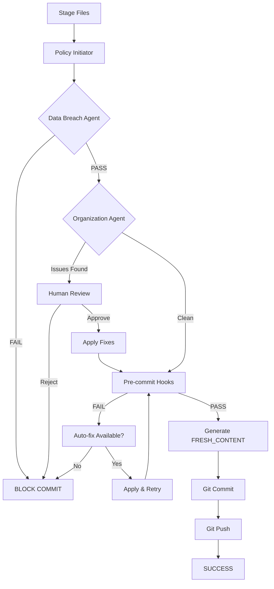

# POLICY-INITIATOR.md - Pre-Commit Policy Orchestration Agent

**Last Updated:** 2025-11-09 1:09 PM MST
**Version:** 1.0.0
**Status:** Active
**Scope:** Ryno-Crypto-Mining-Services/ryno-assets repository

---

## 🎯 Mission

Orchestrate a comprehensive pre-commit workflow that ensures all new content is compliant with security policies, organizational standards, and documentation requirements before being committed and pushed to the public repository.

---

## 📋 Execution Pipeline

The Policy Initiator runs a **6-phase workflow** before every commit:

```
┌─────────────────────────────────────────────────┐
│  Phase 1: Data Breach Detection                │
│  Scan for critical proprietary content         │
└──────────────┬──────────────────────────────────┘
               │ PASS
               ▼
┌─────────────────────────────────────────────────┐
│  Phase 2: Organization & Sanitization          │
│  Validate structure, naming, content hygiene   │
└──────────────┬──────────────────────────────────┘
               │ APPROVE
               ▼
┌─────────────────────────────────────────────────┐
│  Phase 3: Pre-Commit Hooks                     │
│  Run standard quality checks                   │
└──────────────┬──────────────────────────────────┘
               │ PASS
               ▼
┌─────────────────────────────────────────────────┐
│  Phase 4: Content Documentation                │
│  Generate FRESH_CONTENT.md changelog           │
└──────────────┬──────────────────────────────────┘
               │ COMPLETE
               ▼
┌─────────────────────────────────────────────────┐
│  Phase 5: Git Commit                           │
│  Commit with detailed conventional message     │
└──────────────┬──────────────────────────────────┘
               │ SUCCESS
               ▼
┌─────────────────────────────────────────────────┐
│  Phase 6: Git Push                             │
│  Push to origin with verification              │
└─────────────────────────────────────────────────┘
```

---

## 🔧 Implementation

### Master Orchestration Script

**Location:** `scripts/policy_initiator.py`

```python
#!/usr/bin/env python3
"""
Policy Initiator - Pre-Commit Orchestration Agent
Coordinates all security, organization, and quality checks before commit
"""

import os
import sys
import json
import subprocess
from datetime import datetime
from pathlib import Path
from typing import Dict, List, Tuple

class PolicyInitiator:
    def __init__(self, repo_path: str = '.'):
        self.repo_path = Path(repo_path)
        self.timestamp = datetime.utcnow()
        self.results = {
            'data_breach': None,
            'organization': None,
            'precommit': None,
            'fresh_content': None,
            'commit': None,
            'push': None
        }
        self.abort = False

    def run_full_pipeline(self, commit_message: str = None, auto_push: bool = True):
        """Execute complete pre-commit pipeline"""
        print("="*70)
        print("🚀 POLICY INITIATOR - Pre-Commit Pipeline")
        print("="*70)
        print(f"Timestamp: {self.timestamp.isoformat()}")
        print(f"Auto-push: {auto_push}")
        print("="*70 + "\n")

        try:
            # Phase 1: Data breach detection
            if not self._phase1_data_breach():
                return False

            # Phase 2: Organization & sanitization
            if not self._phase2_organization():
                return False

            # Phase 3: Pre-commit hooks
            if not self._phase3_precommit():
                return False

            # Phase 4: Fresh content documentation
            if not self._phase4_fresh_content():
                return False

            # Phase 5: Git commit
            if not self._phase5_commit(commit_message):
                return False

            # Phase 6: Git push
            if auto_push:
                if not self._phase6_push():
                    return False

            self._print_success_summary()
            return True

        except KeyboardInterrupt:
            print("\n\n⚠️  Pipeline interrupted by user")
            return False
        except Exception as e:
            print(f"\n\n❌ Pipeline failed with error: {e}")
            return False

    def _phase1_data_breach(self) -> bool:
        """Phase 1: Run data breach detection agent"""
        print("\n" + "─"*70)
        print("📍 PHASE 1: Data Breach Detection")
        print("─"*70)

        script_path = self.repo_path / 'scripts' / 'data_breach_agent.py'

        if not script_path.exists():
            print(f"⚠️  Data breach agent not found: {script_path}")
            print("   Creating placeholder (should be implemented)")
            self.results['data_breach'] = {'status': 'skipped', 'reason': 'script not found'}
            return True

        try:
            result = subprocess.run(
                ['python3', str(script_path)],
                cwd=str(self.repo_path),
                capture_output=True,
                text=True,
                timeout=300
            )

            if result.returncode == 0:
                print("✅ No critical proprietary content detected")
                self.results['data_breach'] = {'status': 'passed', 'violations': 0}
                return True
            else:
                print("❌ CRITICAL: Proprietary content detected!")
                print(result.stdout)
                print("\n🚨 COMMIT BLOCKED - Review OPSEC_ALERT.md immediately")
                self.results['data_breach'] = {'status': 'failed', 'violations': 'detected'}
                self.abort = True
                return False

        except subprocess.TimeoutExpired:
            print("❌ Data breach scan timed out")
            return False
        except Exception as e:
            print(f"⚠️  Error running data breach agent: {e}")
            return self._prompt_continue("Data breach check failed")

    def _phase2_organization(self) -> bool:
        """Phase 2: Run organization & sanitization agent"""
        print("\n" + "─"*70)
        print("📍 PHASE 2: Organization & Sanitization")
        print("─"*70)

        script_path = self.repo_path / 'scripts' / 'organization_sanitation_agent.py'

        if not script_path.exists():
            print(f"⚠️  Organization agent not found: {script_path}")
            print("   Skipping sanitization check")
            self.results['organization'] = {'status': 'skipped'}
            return True

        try:
            # Run in dry-run mode first
            result = subprocess.run(
                ['python3', str(script_path), '--mode=audit'],
                cwd=str(self.repo_path),
                capture_output=True,
                text=True,
                timeout=300
            )

            if result.returncode == 0:
                print("✅ Repository organization compliant")
                self.results['organization'] = {'status': 'passed', 'issues': 0}
                return True
            else:
                print("⚠️  Organization issues detected")
                print(result.stdout)

                # Check if ORGANIZATION_AUDIT_REPORT exists
                report_path = self.repo_path / 'ORGANIZATION_AUDIT_REPORT.md'
                if report_path.exists():
                    print(f"\n📄 Review: {report_path}")

                    # Prompt for approval
                    if self._prompt_approve_sanitization():
                        # Execute fixes
                        exec_result = subprocess.run(
                            ['python3', str(script_path), '--mode=audit', '--execute'],
                            cwd=str(self.repo_path),
                            capture_output=True,
                            text=True,
                            timeout=300
                        )

                        if exec_result.returncode == 0:
                            print("✅ Organization fixes applied")
                            self.results['organization'] = {'status': 'fixed', 'issues': 'resolved'}
                            return True
                        else:
                            print("❌ Failed to apply fixes")
                            return False
                    else:
                        print("⚠️  Sanitization rejected - commit aborted")
                        return False

                return True

        except subprocess.TimeoutExpired:
            print("❌ Organization scan timed out")
            return False
        except Exception as e:
            print(f"⚠️  Error running organization agent: {e}")
            return self._prompt_continue("Organization check failed")

    def _phase3_precommit(self) -> bool:
        """Phase 3: Run standard pre-commit hooks"""
        print("\n" + "─"*70)
        print("📍 PHASE 3: Pre-Commit Hooks")
        print("─"*70)

        try:
            result = subprocess.run(
                ['pre-commit', 'run', '--all-files'],
                cwd=str(self.repo_path),
                capture_output=True,
                text=True,
                timeout=600
            )

            print(result.stdout)

            if result.returncode == 0:
                print("✅ All pre-commit hooks passed")
                self.results['precommit'] = {'status': 'passed'}
                return True
            else:
                print("⚠️  Some pre-commit hooks failed")
                print(result.stderr)

                # Check if failures are auto-fixed
                if 'Fixed' in result.stdout or 'Fixing' in result.stdout:
                    print("ℹ️  Auto-fixes applied, re-running...")
                    # Re-run to verify fixes
                    rerun = subprocess.run(
                        ['pre-commit', 'run', '--all-files'],
                        cwd=str(self.repo_path),
                        capture_output=True,
                        text=True,
                        timeout=600
                    )

                    if rerun.returncode == 0:
                        print("✅ Pre-commit hooks passed after auto-fix")
                        return True

                return self._prompt_continue("Pre-commit hooks failed")

        except subprocess.TimeoutExpired:
            print("❌ Pre-commit hooks timed out")
            return False
        except FileNotFoundError:
            print("⚠️  pre-commit not installed or not in PATH")
            return self._prompt_continue("Pre-commit not available")
        except Exception as e:
            print(f"⚠️  Error running pre-commit: {e}")
            return self._prompt_continue("Pre-commit check failed")

    def _phase4_fresh_content(self) -> bool:
        """Phase 4: Document new content in FRESH_CONTENT.md"""
        print("\n" + "─"*70)
        print("📍 PHASE 4: Fresh Content Documentation")
        print("─"*70)

        try:
            # Get staged files
            staged_files = self._get_staged_files()

            if not staged_files:
                print("ℹ️  No new files to document")
                self.results['fresh_content'] = {'status': 'skipped', 'files': 0}
                return True

            # Generate content documentation
            content_doc = self._generate_fresh_content_doc(staged_files)

            # Append to FRESH_CONTENT.md
            fresh_content_path = self.repo_path / 'FRESH_CONTENT.md'

            # Create file if doesn't exist
            if not fresh_content_path.exists():
                with open(fresh_content_path, 'w') as f:
                    f.write("# Fresh Content Log\n\n")
                    f.write("Documentation of new additions to the repository.\n\n")
                    f.write("---\n\n")

            # Append new content
            with open(fresh_content_path, 'a') as f:
                f.write(content_doc)

            # Stage the updated FRESH_CONTENT.md
            subprocess.run(['git', 'add', 'FRESH_CONTENT.md'], cwd=str(self.repo_path))

            print(f"✅ Documented {len(staged_files)} new files in FRESH_CONTENT.md")
            self.results['fresh_content'] = {'status': 'completed', 'files': len(staged_files)}
            return True

        except Exception as e:
            print(f"⚠️  Error documenting fresh content: {e}")
            return self._prompt_continue("Fresh content documentation failed")

    def _get_staged_files(self) -> List[str]:
        """Get list of staged files"""
        result = subprocess.run(
            ['git', 'diff', '--cached', '--name-only'],
            cwd=str(self.repo_path),
            capture_output=True,
            text=True
        )

        files = [f for f in result.stdout.strip().split('\n') if f]

        # Filter out report files and config
        exclude = ['OPSEC_ALERT.md', 'RECOVERY_PLAN.md', 'POST_MORTEM.md',
                  'ORGANIZATION_AUDIT_REPORT.md', 'FRESH_CONTENT.md']
        files = [f for f in files if Path(f).name not in exclude]

        return files

    def _generate_fresh_content_doc(self, files: List[str]) -> str:
        """Generate documentation entry for fresh content"""
        doc = f"## Update: {self.timestamp.strftime('%Y-%m-%d %H:%M:%S')} UTC\n\n"

        # Categorize files
        categories = {
            'Documentation': [],
            'PRDs': [],
            'Specifications': [],
            'Media Assets': [],
            'Scripts': [],
            'Other': []
        }

        for file in files:
            filepath = Path(file)

            if filepath.suffix == '.md' and 'prd' not in str(filepath):
                categories['Documentation'].append(file)
            elif 'prd' in str(filepath):
                categories['PRDs'].append(file)
            elif 'spec' in str(filepath):
                categories['Specifications'].append(file)
            elif filepath.suffix in ['.png', '.jpg', '.svg', '.gif', '.mp4']:
                categories['Media Assets'].append(file)
            elif filepath.suffix in ['.py', '.sh', '.js']:
                categories['Scripts'].append(file)
            else:
                categories['Other'].append(file)

        # Document each category
        for category, file_list in categories.items():
            if file_list:
                doc += f"### {category} ({len(file_list)} files)\n\n"
                for file in file_list:
                    status = self._get_file_status(file)
                    file_type = self._classify_file_type(file)
                    doc += f"- **`{file}`**\n"
                    doc += f"  - Status: {status}\n"
                    doc += f"  - Type: {file_type}\n"
                    doc += f"  - Size: {self._get_file_size(file)}\n"

                    # Add description if available
                    description = self._extract_description(file)
                    if description:
                        doc += f"  - Description: {description}\n"

                    doc += "\n"

        # Summary
        doc += f"**Total Files Added/Modified:** {len(files)}\n\n"
        doc += "---\n\n"

        return doc

    def _get_file_status(self, filepath: str) -> str:
        """Determine if file is new or modified"""
        result = subprocess.run(
            ['git', 'diff', '--cached', '--name-status', filepath],
            cwd=str(self.repo_path),
            capture_output=True,
            text=True
        )

        if result.stdout.startswith('A'):
            return 'New'
        elif result.stdout.startswith('M'):
            return 'Modified'
        elif result.stdout.startswith('R'):
            return 'Renamed'
        else:
            return 'Updated'

    def _classify_file_type(self, filepath: str) -> str:
        """Classify file type"""
        path = Path(filepath)

        if path.suffix == '.md':
            return 'Markdown Documentation'
        elif path.suffix == '.pdf':
            return 'PDF Document'
        elif path.suffix in ['.png', '.jpg', '.jpeg']:
            return 'Image'
        elif path.suffix == '.svg':
            return 'Vector Graphic'
        elif path.suffix in ['.mp4', '.mov']:
            return 'Video'
        elif path.suffix == '.py':
            return 'Python Script'
        elif path.suffix in ['.yaml', '.yml']:
            return 'YAML Configuration'
        else:
            return 'File'

    def _get_file_size(self, filepath: str) -> str:
        """Get human-readable file size"""
        try:
            size = (self.repo_path / filepath).stat().st_size

            if size < 1024:
                return f"{size} B"
            elif size < 1024 * 1024:
                return f"{size / 1024:.1f} KB"
            elif size < 1024 * 1024 * 1024:
                return f"{size / (1024 * 1024):.1f} MB"
            else:
                return f"{size / (1024 * 1024 * 1024):.1f} GB"
        except:
            return "Unknown"

    def _extract_description(self, filepath: str) -> str:
        """Extract description from file (first paragraph or heading)"""
        path = self.repo_path / filepath

        if not path.suffix in ['.md', '.txt']:
            return ""

        try:
            with open(path, 'r', errors='ignore') as f:
                lines = f.readlines()

            # Find first substantial paragraph
            for i, line in enumerate(lines):
                line = line.strip()
                if line and not line.startswith('#') and len(line) > 20:
                    # Truncate to reasonable length
                    return line[:100] + ('...' if len(line) > 100 else '')

            return ""
        except:
            return ""

    def _phase5_commit(self, commit_message: str = None) -> bool:
        """Phase 5: Create git commit"""
        print("\n" + "─"*70)
        print("📍 PHASE 5: Git Commit")
        print("─"*70)

        try:
            # Generate commit message if not provided
            if not commit_message:
                commit_message = self._generate_commit_message()

            print(f"Commit message:\n{commit_message}\n")

            # Execute commit
            result = subprocess.run(
                ['git', 'commit', '-m', commit_message],
                cwd=str(self.repo_path),
                capture_output=True,
                text=True
            )

            if result.returncode == 0:
                print("✅ Commit successful")
                print(result.stdout)
                self.results['commit'] = {'status': 'success', 'message': commit_message}
                return True
            else:
                print("❌ Commit failed")
                print(result.stderr)
                self.results['commit'] = {'status': 'failed'}
                return False

        except Exception as e:
            print(f"❌ Error during commit: {e}")
            return False

    def _phase6_push(self) -> bool:
        """Phase 6: Push to remote"""
        print("\n" + "─"*70)
        print("📍 PHASE 6: Git Push")
        print("─"*70)

        try:
            # Get current branch
            branch_result = subprocess.run(
                ['git', 'rev-parse', '--abbrev-ref', 'HEAD'],
                cwd=str(self.repo_path),
                capture_output=True,
                text=True
            )

            branch = branch_result.stdout.strip()
            print(f"Pushing to: origin/{branch}")

            # Execute push
            result = subprocess.run(
                ['git', 'push', 'origin', branch],
                cwd=str(self.repo_path),
                capture_output=True,
                text=True,
                timeout=60
            )

            if result.returncode == 0:
                print("✅ Push successful")
                print(result.stdout)
                self.results['push'] = {'status': 'success', 'branch': branch}
                return True
            else:
                print("❌ Push failed")
                print(result.stderr)

                # Common issues
                if 'rejected' in result.stderr:
                    print("\nℹ️  Pull remote changes first: git pull origin main")

                self.results['push'] = {'status': 'failed'}
                return False

        except subprocess.TimeoutExpired:
            print("❌ Push timed out")
            return False
        except Exception as e:
            print(f"❌ Error during push: {e}")
            return False

    def _generate_commit_message(self) -> str:
        """Generate conventional commit message"""
        staged_files = self._get_staged_files()

        # Determine commit type
        has_docs = any('.md' in f or '.pdf' in f for f in staged_files)
        has_assets = any(any(ext in f for ext in ['.png', '.jpg', '.svg']) for f in staged_files)
        has_code = any(any(ext in f for ext in ['.py', '.js', '.sh']) for f in staged_files)

        if has_code:
            commit_type = "feat"
            scope = "scripts"
        elif has_docs and has_assets:
            commit_type = "docs"
            scope = "content"
        elif has_docs:
            commit_type = "docs"
            scope = "documentation"
        elif has_assets:
            commit_type = "chore"
            scope = "assets"
        else:
            commit_type = "chore"
            scope = "repository"

        # Generate subject
        file_count = len(staged_files)
        subject = f"add {file_count} file{'s' if file_count != 1 else ''} to {scope}"

        # Generate body
        body = f"Added via Policy Initiator at {self.timestamp.isoformat()}\n\n"
        body += "Changes:\n"
        for file in staged_files[:10]:  # Limit to 10 files
            body += f"- {file}\n"

        if len(staged_files) > 10:
            body += f"- ...and {len(staged_files) - 10} more\n"

        body += "\n"
        body += "Pipeline Results:\n"
        body += f"- Data Breach Check: {self.results['data_breach']['status']}\n"
        body += f"- Organization Check: {self.results['organization']['status']}\n"
        body += f"- Pre-commit Hooks: {self.results['precommit']['status']}\n"

        # Combine
        message = f"{commit_type}({scope}): {subject}\n\n{body}"

        return message

    def _prompt_continue(self, reason: str) -> bool:
        """Prompt user to continue despite issues"""
        print(f"\n⚠️  {reason}")
        response = input("Continue anyway? (yes/no): ").lower()
        return response in ['yes', 'y']

    def _prompt_approve_sanitization(self) -> bool:
        """Prompt user to approve sanitization changes"""
        print("\n📋 Organization agent detected issues requiring fixes.")
        print("   Review ORGANIZATION_AUDIT_REPORT.md for details")
        response = input("Apply recommended fixes? (yes/no): ").lower()
        return response in ['yes', 'y']

    def _print_success_summary(self):
        """Print final success summary"""
        print("\n" + "="*70)
        print("✅ PIPELINE COMPLETE - All Phases Successful")
        print("="*70)
        print("\n📊 Phase Results:")
        print(f"  1. Data Breach Detection:    {self.results['data_breach']['status'].upper()}")
        print(f"  2. Organization & Sanitation: {self.results['organization']['status'].upper()}")
        print(f"  3. Pre-Commit Hooks:          {self.results['precommit']['status'].upper()}")
        print(f"  4. Fresh Content Doc:         {self.results['fresh_content']['status'].upper()}")
        print(f"  5. Git Commit:                {self.results['commit']['status'].upper()}")

        if self.results['push']:
            print(f"  6. Git Push:                  {self.results['push']['status'].upper()}")

        print("\n" + "="*70)
        print("🎉 Changes committed and pushed successfully!")
        print("="*70 + "\n")

def main():
    import argparse

    parser = argparse.ArgumentParser(
        description='Policy Initiator - Comprehensive pre-commit pipeline',
        formatter_class=argparse.RawDescriptionHelpFormatter,
        epilog="""
Examples:
  # Interactive mode (prompts for approval)
  python3 scripts/policy_initiator.py

  # With custom commit message
  python3 scripts/policy_initiator.py -m "feat(docs): add new PRD"

  # Commit without pushing
  python3 scripts/policy_initiator.py --no-push

  # Non-interactive mode (auto-approve everything)
  python3 scripts/policy_initiator.py --auto-approve
        """
    )

    parser.add_argument('-m', '--message',
                       help='Custom commit message')
    parser.add_argument('--no-push', action='store_true',
                       help='Commit but do not push')
    parser.add_argument('--auto-approve', action='store_true',
                       help='Automatically approve all fixes (use with caution)')
    parser.add_argument('--repo-path', default='.',
                       help='Path to repository')

    args = parser.parse_args()

    # Initialize agent
    agent = PolicyInitiator(repo_path=args.repo_path)

    # Run pipeline
    success = agent.run_full_pipeline(
        commit_message=args.message,
        auto_push=not args.no_push
    )

    # Exit with appropriate code
    sys.exit(0 if success else 1)

if __name__ == '__main__':
    main()
```

---

## 📋 Usage Guide

### Interactive Mode (Recommended)

```bash
# Stage your files first
git add path/to/new/files

# Run policy initiator
python3 scripts/policy_initiator.py

# Follow prompts for any required approvals
```

### With Custom Commit Message

```bash
git add .
python3 scripts/policy_initiator.py -m "docs(prd): add treasury management PRD v1.0"
```

### Commit Without Pushing

```bash
git add .
python3 scripts/policy_initiator.py --no-push

# Review, then push manually
git push
```

### Non-Interactive (CI/CD)

```bash
# Auto-approve everything (use carefully)
git add .
python3 scripts/policy_initiator.py --auto-approve
```

---

## 🔗 Integration Options

### Option 1: Git Alias (Recommended)

Add to `.git/config` or `~/.gitconfig`:

```ini
[alias]
    commit-safe = !python3 scripts/policy_initiator.py
    cs = !python3 scripts/policy_initiator.py
```

**Usage:**
```bash
git add .
git commit-safe
# or
git cs
```

### Option 2: Shell Alias

Add to `~/.bashrc` or `~/.zshrc`:

```bash
alias gcs='python3 scripts/policy_initiator.py'
```

### Option 3: Pre-Commit Hook (Automatic)

**Note:** This runs automatically on every commit, which may be intrusive.

Create `.git/hooks/pre-commit`:

```bash
#!/bin/bash
python3 scripts/policy_initiator.py --no-push "$@"
```

Make executable:
```bash
chmod +x .git/hooks/pre-commit
```

### Option 4: GitHub Actions Workflow

**For automated merges or scheduled commits:**

`.github/workflows/policy-commit.yml`:

```yaml
name: Policy-Compliant Commit

on:
  workflow_dispatch:
    inputs:
      files:
        description: 'Files to commit (comma-separated)'
        required: true
      message:
        description: 'Commit message'
        required: true

jobs:
  commit:
    runs-on: ubuntu-latest
    steps:
      - uses: actions/checkout@v3

      - name: Set up Python
        uses: actions/setup-python@v4
        with:
          python-version: '3.11'

      - name: Install pre-commit
        run: pip install pre-commit

      - name: Stage files
        run: |
          IFS=',' read -ra FILES <<< "${{ github.event.inputs.files }}"
          for file in "${FILES[@]}"; do
            git add "$file"
          done

      - name: Run Policy Initiator
        run: |
          python3 scripts/policy_initiator.py \
            --message "${{ github.event.inputs.message }}" \
            --auto-approve

      - name: Verify Push
        run: git log -1 --stat
```

---

## 🛡️ Safety Features

### 1. Multi-Layer Validation

**Critical → Borderline → Quality:**
- Data Breach Agent (critical proprietary)
- Organization Agent (borderline sensitive)
- Pre-commit Hooks (quality/format)

### 2. Human Approval Gates

**Agent presents findings, human decides:**
- Review all proposed redactions
- Approve or reject with justification
- No automatic execution of destructive changes

### 3. Comprehensive Logging

**All actions logged:**
- `FRESH_CONTENT.md` - What was added
- `ORGANIZATION_AUDIT_REPORT.md` - What was changed
- Git commit message - Complete change summary

### 4. Reversibility

**Easy rollback:**
```bash
# Undo last commit (keep changes)
git reset --soft HEAD^

# Undo last commit (discard changes)
git reset --hard HEAD^

# Revert specific commit
git revert <commit-hash>
```

---

## 📊 FRESH_CONTENT.md Format

### Example Output

```markdown
# Fresh Content Log

Documentation of new additions to the repository.

---

## Update: 2025-11-09 13:09:00 UTC

### Documentation (3 files)

- **`docs/architecture/mining-container-design.md`**
  - Status: New
  - Type: Markdown Documentation
  - Size: 45.2 KB
  - Description: Comprehensive design documentation for 1.5MW bitcoin mining container with liquid cooling

- **`docs/guides/installation-guide.md`**
  - Status: New
  - Type: Markdown Documentation
  - Size: 12.8 KB
  - Description: Step-by-step installation procedures for TerraHash Stack

- **`prd/active/ai-optimization-prd.md`**
  - Status: Modified
  - Type: Markdown Documentation
  - Size: 23.1 KB
  - Description: Updated PRD with revised success metrics

### Media Assets (2 files)

- **`assets/diagrams/architecture/ths-stack-cooling-diagram-1920x1080-v1-0.svg`**
  - Status: New
  - Type: Vector Graphic
  - Size: 234.5 KB

- **`assets/images/terrahash-stack/ths-stack-container-photo-3840x2160-v1-0.jpg`**
  - Status: New
  - Type: Image
  - Size: 2.3 MB

**Total Files Added/Modified:** 5

---
```

---

## 🎯 Workflow Example

### Complete Pre-Commit Workflow

```bash
# 1. Create or modify files
vim docs/new-document.md
cp ~/images/diagram.png assets/diagrams/

# 2. Stage changes
git add docs/new-document.md
git add assets/diagrams/diagram.png

# 3. Run Policy Initiator
python3 scripts/policy_initiator.py

# Output:
# ======================================================================
# 🚀 POLICY INITIATOR - Pre-Commit Pipeline
# ======================================================================
#
# ──────────────────────────────────────────────────────────────────────
# 📍 PHASE 1: Data Breach Detection
# ──────────────────────────────────────────────────────────────────────
# ✅ No critical proprietary content detected
#
# ──────────────────────────────────────────────────────────────────────
# 📍 PHASE 2: Organization & Sanitization
# ──────────────────────────────────────────────────────────────────────
# ⚠️  Organization issues detected
# 📄 Review: ORGANIZATION_AUDIT_REPORT.md
#
# Apply recommended fixes? (yes/no): yes
# ✅ Organization fixes applied
#
# ──────────────────────────────────────────────────────────────────────
# 📍 PHASE 3: Pre-Commit Hooks
# ──────────────────────────────────────────────────────────────────────
# Trim trailing whitespace...Passed
# Fix end of files...........Passed
# Check YAML syntax..........Passed
# ✅ All pre-commit hooks passed
#
# ──────────────────────────────────────────────────────────────────────
# 📍 PHASE 4: Fresh Content Documentation
# ──────────────────────────────────────────────────────────────────────
# ✅ Documented 2 new files in FRESH_CONTENT.md
#
# ──────────────────────────────────────────────────────────────────────
# 📍 PHASE 5: Git Commit
# ──────────────────────────────────────────────────────────────────────
# Commit message:
# docs(content): add 2 files to content
#
# ✅ Commit successful
#
# ──────────────────────────────────────────────────────────────────────
# 📍 PHASE 6: Git Push
# ──────────────────────────────────────────────────────────────────────
# Pushing to: origin/main
# ✅ Push successful
#
# ======================================================================
# ✅ PIPELINE COMPLETE - All Phases Successful
# ======================================================================
```

---

## 🚦 Exit Codes

| Code | Meaning | Action |
|------|---------|--------|
| 0 | Success | All phases passed, changes committed & pushed |
| 1 | Data breach | Critical content detected, commit blocked |
| 2 | User abort | User rejected sanitization or chose not to continue |
| 3 | Pre-commit fail | Quality checks failed, fix and retry |
| 4 | Git error | Commit or push failed, check git status |

---

## 🎓 Training Guide

### For New Contributors

**First-time setup:**
```bash
# Clone repository
git clone https://github.com/Ryno-Crypto-Mining-Services/ryno-assets
cd ryno-assets

# Install dependencies
pip install pre-commit
pre-commit install

# Make policy initiator executable
chmod +x scripts/policy_initiator.py

# Create git alias
git config alias.commit-safe '!python3 scripts/policy_initiator.py'
```

**Every commit:**
```bash
# Instead of: git commit -m "message"
# Use:
git add .
git commit-safe
```

### For Repository Maintainers

**Weekly responsibilities:**
- Review `FRESH_CONTENT.md` for new additions
- Check `ORGANIZATION_AUDIT_REPORT.md` for trends
- Monitor false positive rates
- Update agent patterns as needed

---

## 🔄 Agent Coordination

### Pipeline Flow



### Agent Responsibilities

| Phase | Agent | Blocks Commit | Generates Reports |
|-------|-------|---------------|-------------------|
| 1 | Data Breach | YES | OPSEC_ALERT.md |
| 2 | Organization | With approval | ORGANIZATION_AUDIT_REPORT.md |
| 3 | Pre-commit | YES | Console output |
| 4 | Policy Initiator | N/A | FRESH_CONTENT.md |

---

## 📅 Maintenance

### Weekly
- Review FRESH_CONTENT.md entries
- Check for agent errors or timeouts
- Monitor commit success rate

### Monthly
- Analyze false positive trends
- Update keyword patterns
- Tune redaction sensitivity
- Review user feedback

### Quarterly
- Comprehensive agent effectiveness review
- Update documentation
- Retrain contributors
- Align with CLAUDE.md updates

---

## 🔐 Security Considerations

**The Policy Initiator has elevated privileges:**
- Can modify repository content
- Can commit and push changes
- Runs automated agents

**Safeguards:**
- Human approval for destructive operations
- Comprehensive logging of all actions
- Git history provides complete audit trail
- Reversibility via standard git operations

**Access control:**
- Only trusted maintainers should modify agent code
- Agent scripts should be code-reviewed
- Regular security audits of agent behavior

---

## ✅ Success Metrics

**Pipeline effectiveness:**
- **Commit block rate:** <5% (most content is already compliant)
- **False positive rate:** <10% (agent accuracy)
- **Time to commit:** <2 minutes average
- **User satisfaction:** Positive feedback from contributors

**Security effectiveness:**
- **Zero critical breaches** reaching production
- **Sanitization coverage:** >95% of borderline content caught
- **Compliance rate:** 100% CLAUDE.md adherence

---

## 📞 Support

**Issues with Policy Initiator:**
- GitHub Issues with label: `policy-initiator`
- Email: support@rynocrypto.com

**Agent Behavior Questions:**
- Review agent .md files (data-breach-agent.md, organization-sanitation-agent.md)
- Contact: security@rynocrypto.com

**False Positives:**
- Document in GitHub issue
- Agents will be tuned to reduce false positives

---

## 🎉 Benefits

**For Contributors:**
- ✅ Single command for compliant commits
- ✅ Automated quality checks
- ✅ Clear feedback on issues
- ✅ Reduced anxiety about policy violations

**For Maintainers:**
- ✅ Consistent repository organization
- ✅ Comprehensive audit trail
- ✅ Proactive security enforcement
- ✅ Reduced manual review burden

**For Organization:**
- ✅ Protected intellectual property
- ✅ CLAUDE.md compliance
- ✅ Professional repository appearance
- ✅ Community trust through transparency

---

**Document Version:** 1.0.0
**Maintained By:** Ryno Crypto Services Repository Team
**Review Frequency:** Quarterly
**Next Review:** 2026-02-09

---

*"Commit with confidence, push with certainty."*
